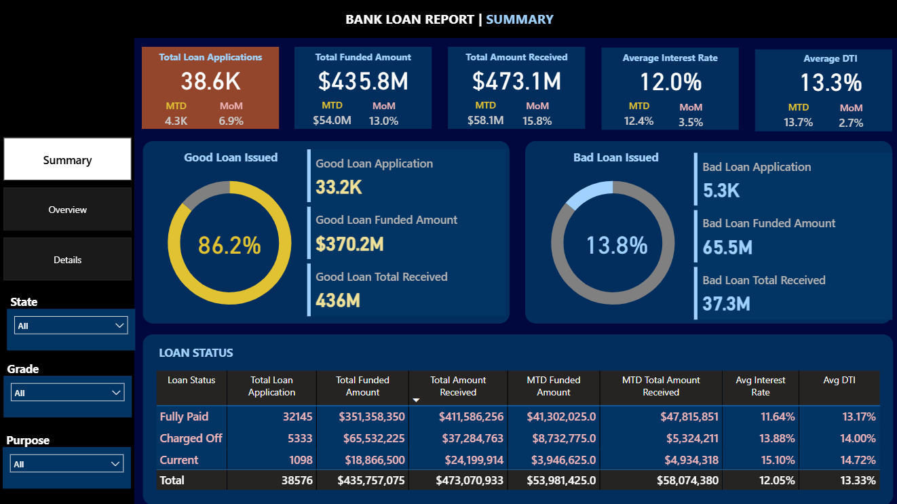
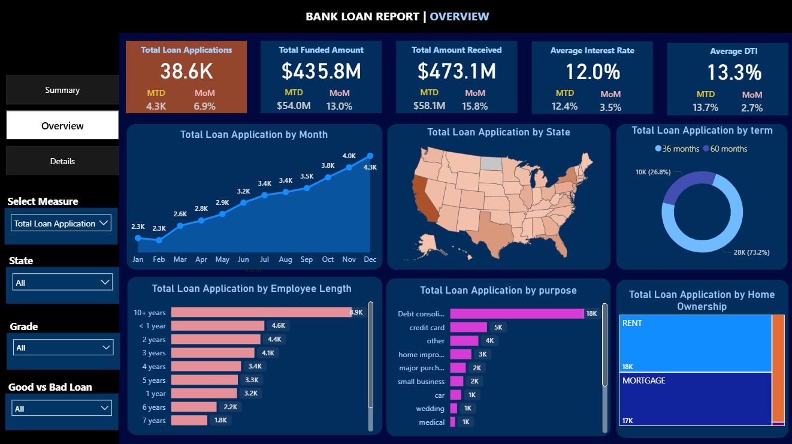
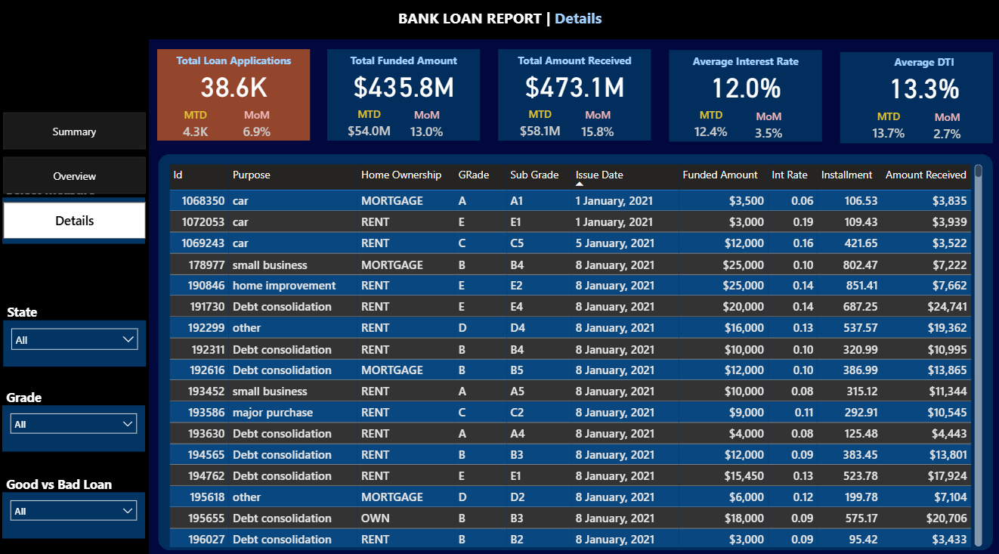

# Marketing Analysis - Online Retain Business

Apex Horizon Bank is a financial institution focused on consumer lending. To maintain a competitive edge and ensure fiscal responsibility, the bank is transitioning from static reporting to a dynamic. The company is planning to implement data-driven analytical framework to oversee its diverse loan portfolio.

---

## Table of Contents
- <a href="#business-problem">Business Problem</a>
- <a href="#dataset">Dataset</a>
- <a href="#tools--technologies">Tools and Technologies</a>
- <a href="#dashboard">Dashboard</a>
- <a href="#key-findings">Research Questions and Key Findings</a>
- <a href="#final-recommendations">Final Recommendations</a>

---
<h2>Business Problem</h2>

The bank is lacking real-time visibility in tracking immediate performance shifts in the month-to-date and month-to-month changes.Similarly, it is facing challenges in identifying ‘Good’ and ‘Bad’ loans, which indicates a need for clear insights into risk and losses. The bank is also unable to determine how geographical location, employment history, or home ownership impact loan disbursement.

**Key Performing Indicators :**
- **Total Applications:** Count of applications received; tracked MTD and MoM
- **Financial Flow:** Total Funded Amount (disbursed) vs. Total Amount Received (repayments)
- **Risk Metrics:** Average Interest Rate and Average Debt-to-Income (DTI) Ratio

---
<h2>Dataset</h2>

- Dataset(financial_loan_data) contains multiple columns(address_state, application_type, emp_length	emp_title, grade, home_ownership, issue_date, last_credit_pull_date	last_payment_date, loan_status	next_payment_date, member_id, purpose, sub_grade, term, verification_status, annual_income, dti, installment, int_rate, loan_amount, total_acc, total_payment) which is located in '/dataset/' folder 

---
<h2>Tools and Technologies</h2>

- SQL (Data Cleaning)
- Power BI (Interactive Visualization)
- Microsoft Power BI
- Github 

---
<h2>Interactive Dashboard</h2>

The dashboards is designed using Microsoft Power BI which displays:
 - Summary Dashboard 
 - Overview Dashboard
 - Detail Dashboard

<h2>Sumamry</h2>

<h2>Overview</h2>

<h2>Detail</h2>

---
<h2>Key Findings</h2>

<h2>Sumamry</h2>

- The Month-to-Date (MTD) represents a 6.9% Month-over-Month (MoM) increase, showing sustained demand.
- MTD funding grew by 13.0%, indicating we are deploying capital more aggressively this month.
- We’ve seen a 3.5% MoM increase in rates, which will increase our margins if the portfolio quality remains stable.
- Good Loans are performing exceptionally well, ensuring the bank remains liquid.
 The Bad Loan segment is where we face a challenge with a  net loss of roughly $28.2M.
- Charged Off loans have a higher average interest rate (13.88%) and DTI (14.0%) compared to "Fully Paid" loans. This confirms that our higher-interest products are correctly targeting higher-risk profiles, but the default rate on these needs tighter monitoring.

<h2>Overview</h2>

- Debt Consolidation is our largest driver by a significant margin, accounting for 18K applications. We must monitor if these borrowers are successfully deleveraging or simply shifting debt.
- Borrowers with 10+ years of employment history are our most frequent applicants (8.9K), which generally correlates with higher stability and lower default risk.
- Our portfolio is heavily weighted toward Renters (18K) and those with Mortgages (17K), while actual homeowners represent the smallest segment. This is a key data point for the Risk Team, as renters may have less collateral than homeowners during economic downturns.

---
<h2>Final Recommendations</h2>

<h2>Executive Leaders</h2>

**1. Tighten Approval for High-DTI Applicants**
Charged-off loans have a higher average DTI of 14.00% compared to fully paid loans at 13.17%. We should consider lowering the debt-to-income threshold to reduce the 13.8% "Bad Loan" rate.

**2. Aggressive Recovery Strategy**
Implementing a more robust collection or secondary debt-sale strategy could help recoup a portion of the $28.2M currently lost.

**3. Monitor "Current" Loan Transition**
Because of the highest Interest rate and DTI, this segment is at high risk of turning into "Bad Loans"; proactive outreach or refinancing options for these borrowers may prevent future defaults.

**4. Optimize Interest Rate Margins**
We must ensure our pricing increases are outpacing the increased risk profiles of new applicants to maintain profitability.

<h2>Risk Management</h2>

**1. Operational Scaling**
Loan applications surged from 3.8K in October to 4.3K in December. Leadership should plan for increased staffing or automated processing capacity during the second half of the year to handle this consistent seasonal growth.

**2. Deep-Dive into Debt Consolidation**
With 18K applications, debt consolidation is our primary driver. We should audit the "Bad Loan" rate specifically for this category to ensure we aren't just taking on other institutions' high-risk debt.

**3. Incentivize Long-Term Employment**
Borrowers with 10+ years of employment are our largest and most stable segment (8.9K applications). We could offer "Loyalty Rates" to this group to further grow the "Good Loan" side of our portfolio.

**4. Review Renter vs Mortgage Risk**
18K applications come from renters compared to 17K from those with mortgages. Given the lack of property collateral, the risk team should verify if renters are over-represented in the 13.8% "Bad Loan" figure and adjust terms for this segment accordingly.

**5. Focus on 36-Month Terms**
Since 73.2% of our portfolio is in 36-month terms, we have high capital turnover. We should leverage this liquidity to pivot quickly if the rising interest rate environment begins to negatively impact borrower repayment ability.

